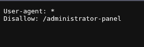
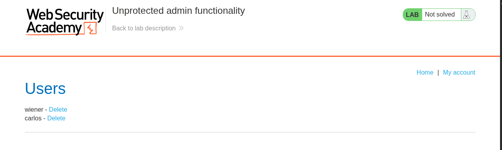

# Lab: Unprotected admin functionality

## Enunciado (traduzido)
Este lab tem um painel de admin desprotegido.
Resolva o lab deletando o usuário `carlos`.

## O que fiz

Para esse precisamos buscar na URL para ver se o servidor foi configurado para ter um arquivo chamado `robots.txt`. O objetivo dele existir é para buscadores como o Google não indexarem em pesquisa páginas que são passadas dentro dele.

Buscando lá temos uma página que está configurada para não mostrar `/administrator-panel`.

Buscando por ela, lá está:

---
[⬅ Voltar](../../README.md)