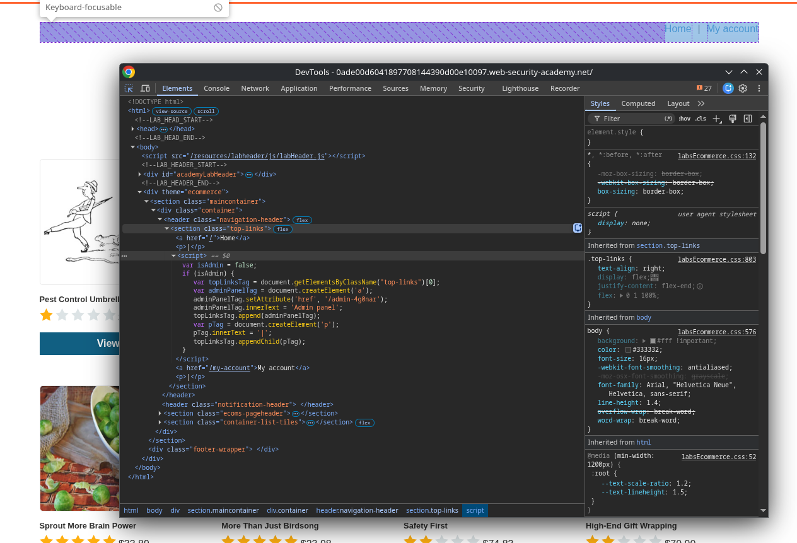
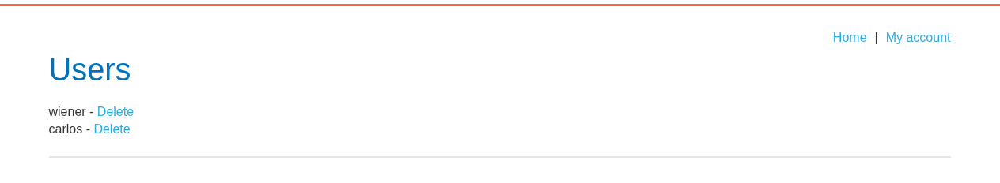

# Lab: Unprotected admin functionality with unpredictable URL

## Enunciado (traduzido)
Este lab tem um painel de admin desprotegido. Ele está localizado em um endereço imprevisível, mas esse endereço é divulgado em algum lugar da aplicação.
Resolva o lab acessando o painel de admin e deletando o usuário carlos.

## O que fiz

Primeiro vamos pensar onde possivelmente pode existir algo para um admin usar assim que abre a página.

Um lugar onde ele possivelmente pode acessar suas funcionalidades é pelo header.

Inspecionando o header, lá está a url `/admin-4g0nar`.

Depois é só excluir o carlos.

---
[⬅ Voltar](../../../README.md)