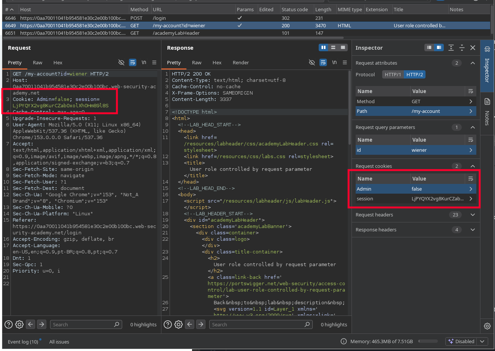
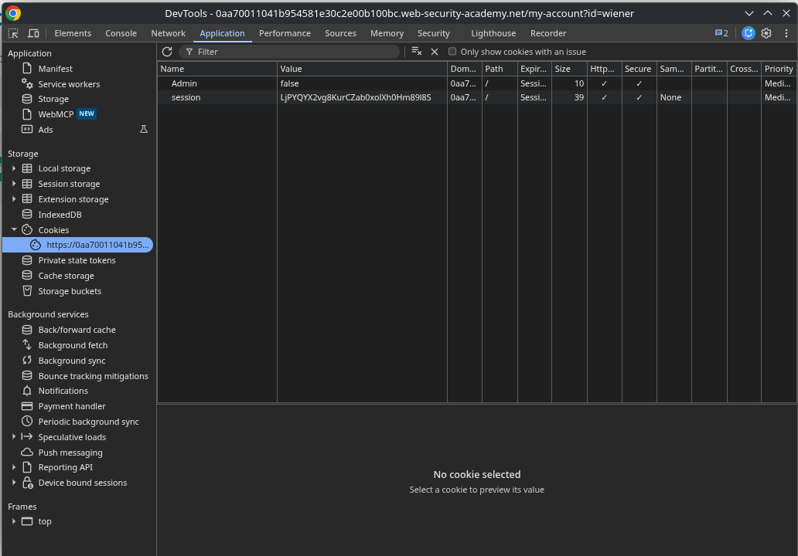
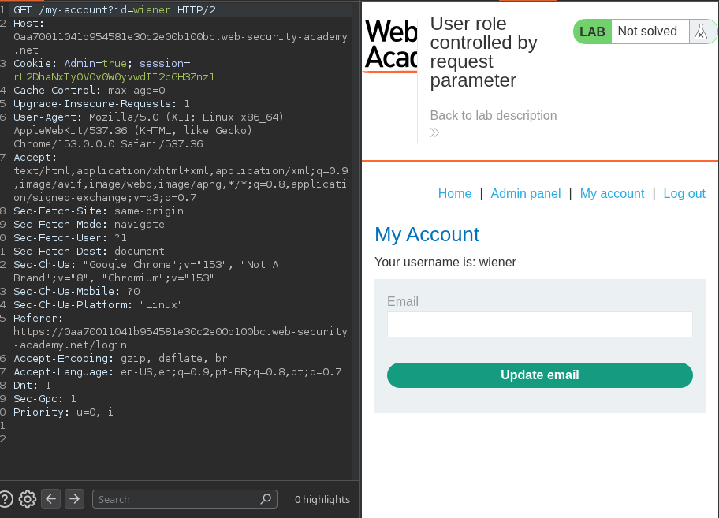

# Lab: User role controlled by request parameter

## Enunciado (traduzido)
Este lab tem um painel de admin em `/admin`, que identifica administradores usando um cookie forjável.
Resolva o lab acessando o painel de admin e deletando o usuário `carlos`.

Você pode logar na sua própria conta usando as credenciais: `wiener:peter`

## O que fiz

Para essa, podemos simplesmente fazer login e buscar possíveis lugares onde ele possa ter salvo nossa categoria de user. Também podemos usar o Burp para ver mais facilmente em alguns lugares.

Como pode ver, ele salvou no cookie. Então podemos fazer de 2 modos:

1. Mudar diretamente no cookie salvo no navegador, de `false` para `true`.

2. Interceptar a requisição e trocar o cookie de `Admin=false` para `Admin=true`.

---
[⬅ Voltar](../../../README.md)