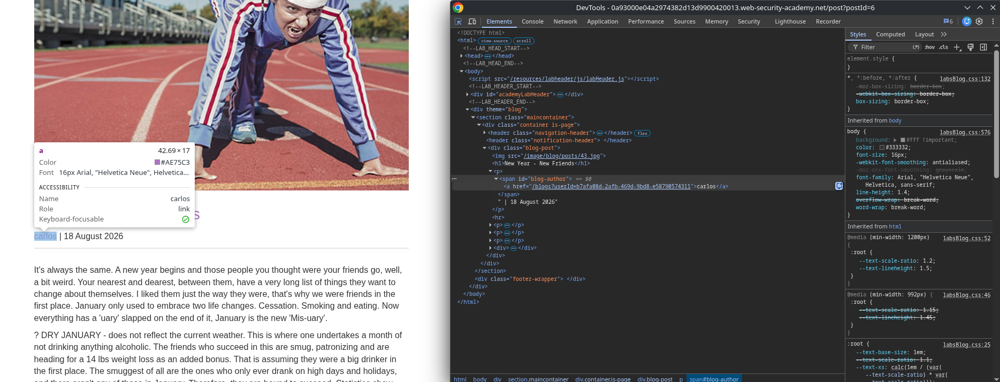
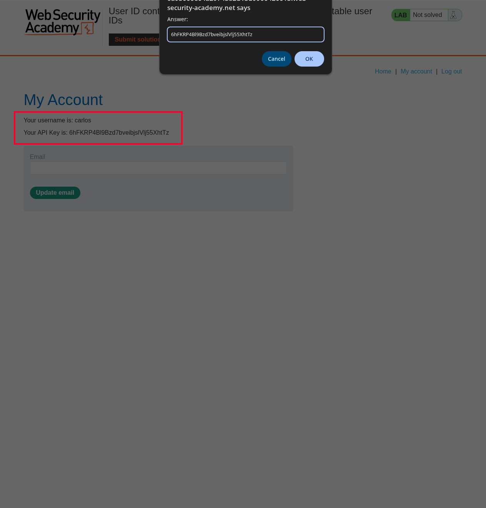

# Lab: User ID controlled by request parameter, with unpredictable user IDs

## Enunciado (traduzido)
Este lab tem uma vulnerabilidade de escalação horizontal de privilégios na página de conta do usuário, mas identifica os usuários com GUIDs.

Para resolver o lab, encontre o GUID do carlos, depois envie a API key dele como solução.

Você pode logar na sua própria conta usando as credenciais: `wiener:peter`

## O que fiz

O objetivo era encontrar a API key do usuário `carlos`. Como o sistema usa GUIDs em vez de IDs sequenciais simples, precisei encontrar onde o GUID dele aparecia na aplicação.

Navegando pelos posts do blog, acessei um post qualquer (`/post?postId=6`) onde o autor era o `carlos`. Inspecionando o link no nome dele, encontrei o seu GUID:

`b7afa08d-2afb-469d-9bd8-e58790574311`

Em seguida, fiz login com a minha conta (`wiener:peter`) e notei que a página da conta carrega as informações com base no parâmetro `id` na URL (`/my-account?id=MEU-GUID`).

Substituí o meu GUID pelo GUID do carlos na URL:
`/my-account?id=b7afa08d-2afb-469d-9bd8-e58790574311`

A aplicação carregou a página da conta do carlos sem validar se a sessão pertencia a ele, expondo sua API Key. Copiei a chave e enviei na solução:

---
[⬅ Voltar](../../../README.md)