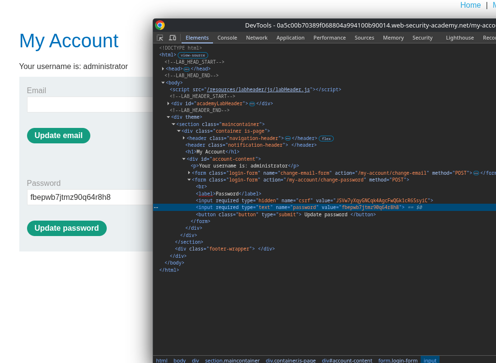
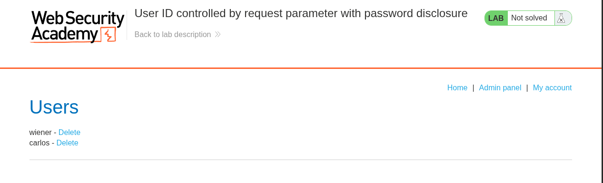

# Lab: User ID controlled by request parameter with password disclosure

## Enunciado (traduzido)
Este lab tem uma página de conta do usuário que contém a senha atual do usuário, pré-preenchida em um input mascarado.

Para resolver o lab, recupere a senha do administrador, depois use-a para deletar o usuário carlos.

Você pode logar na sua própria conta usando as credenciais: `wiener:peter`

## O que fiz

Fiz login com a conta de testes (`wiener:peter`) para verificar como os dados do perfil eram carregados.

Ao acessar a conta, reparei que a URL usava o nome do usuário diretamente como parâmetro:
`/my-account?id=wiener`

Para testar se havia validação de autorização no backend, alterei o parâmetro para `administrator`:
`/my-account?id=administrator`

A aplicação carregou a página do administrador, exibindo o formulário com o campo de senha mascarado pré-preenchido.

Inspecionei o elemento no DevTools e alterei o atributo de `type="password"` para `type="text"` para revelar a senha em texto claro:

Com a senha recuperada, desloguei da conta de teste, fiz login como `administrator` e deletei o usuário `carlos` pelo painel:

---
[⬅ Voltar](../../../README.md)