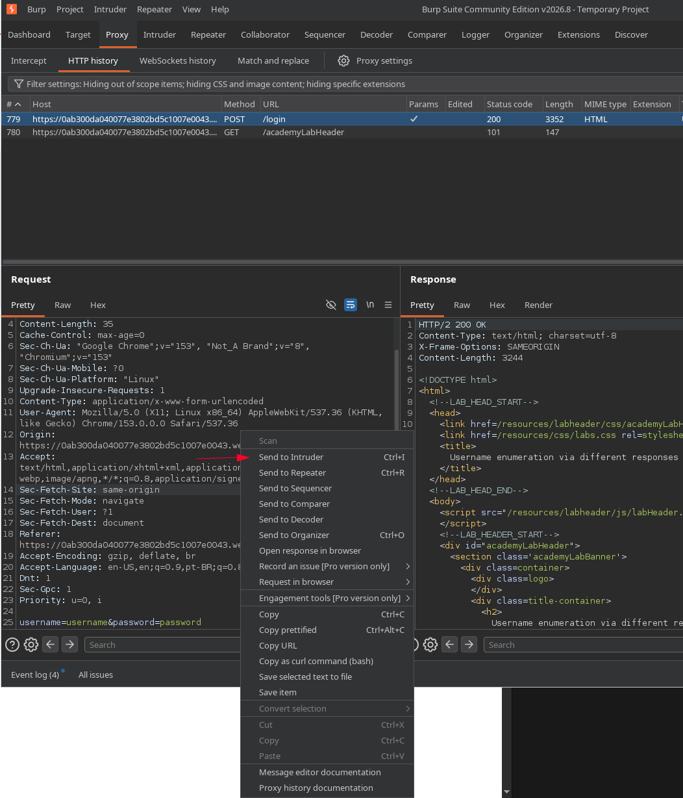
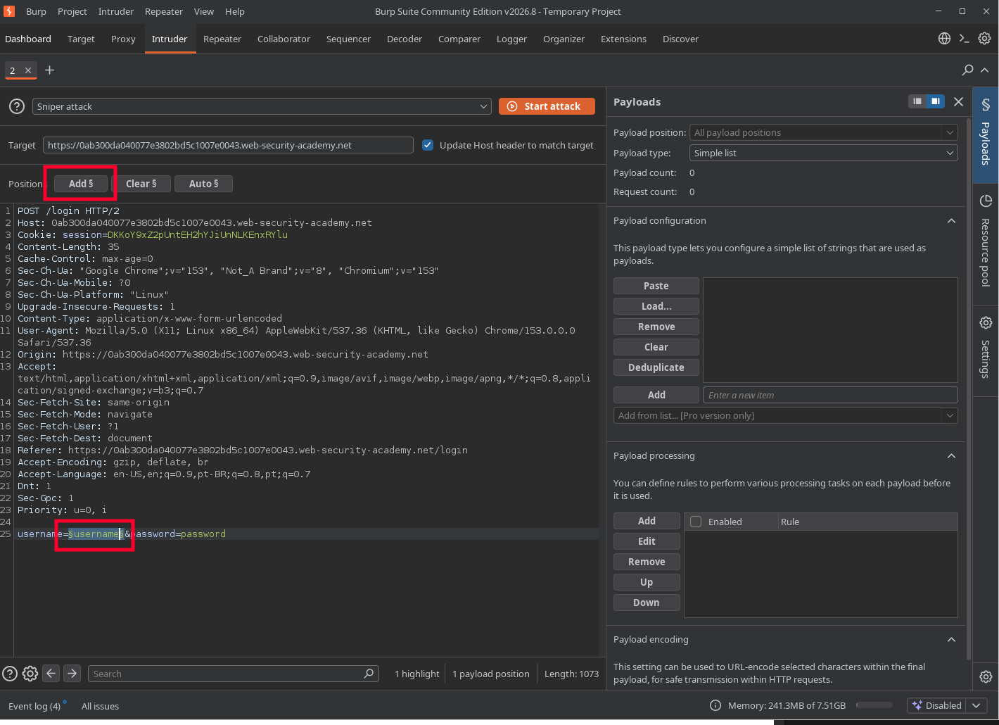
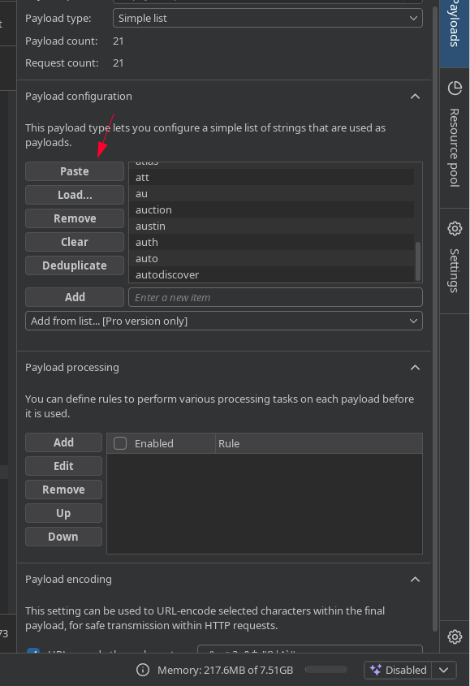
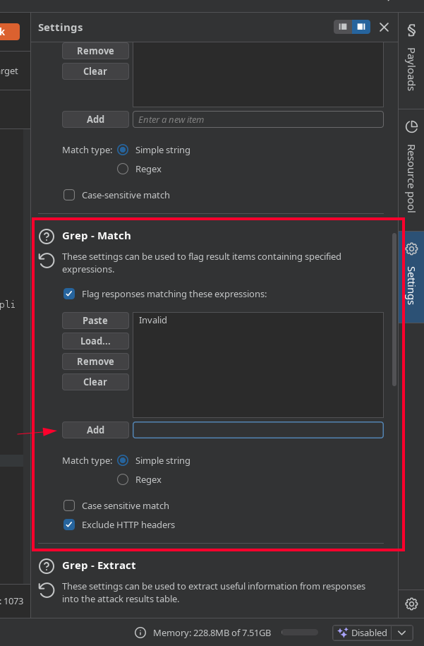
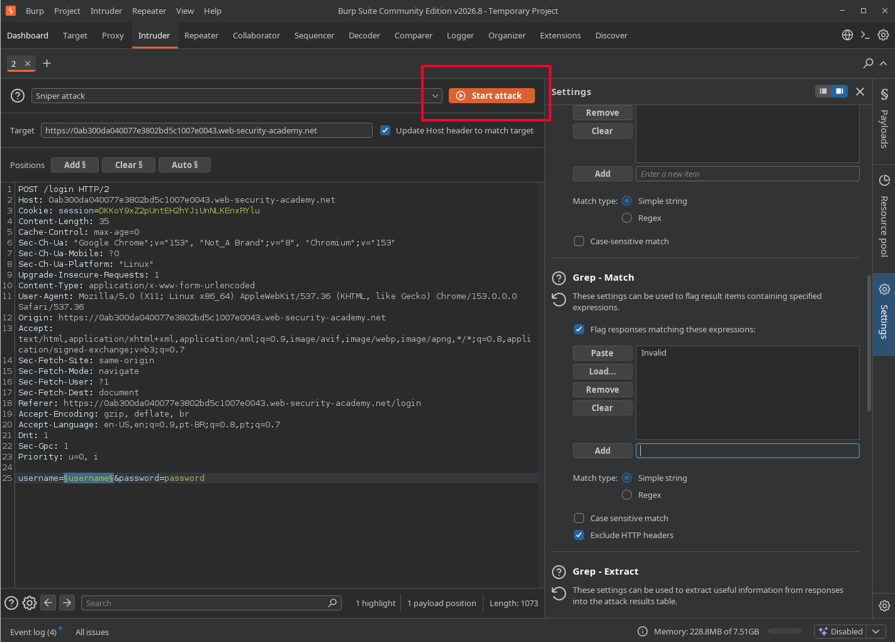
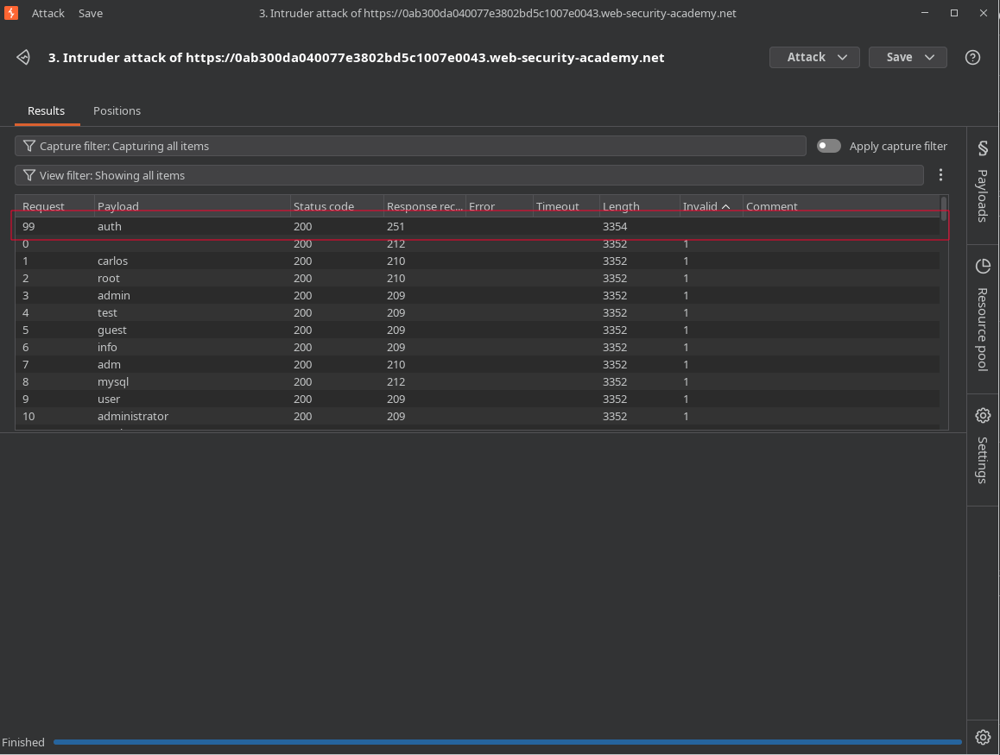
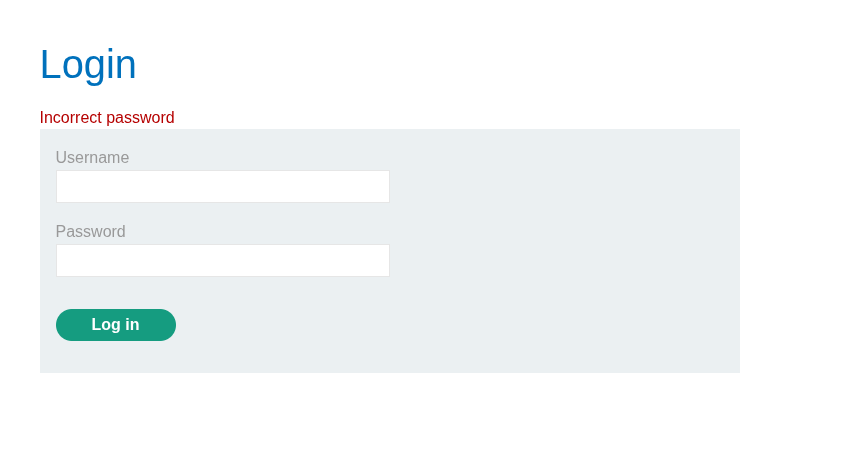
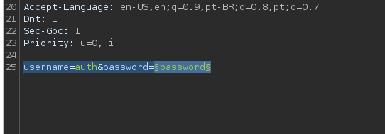
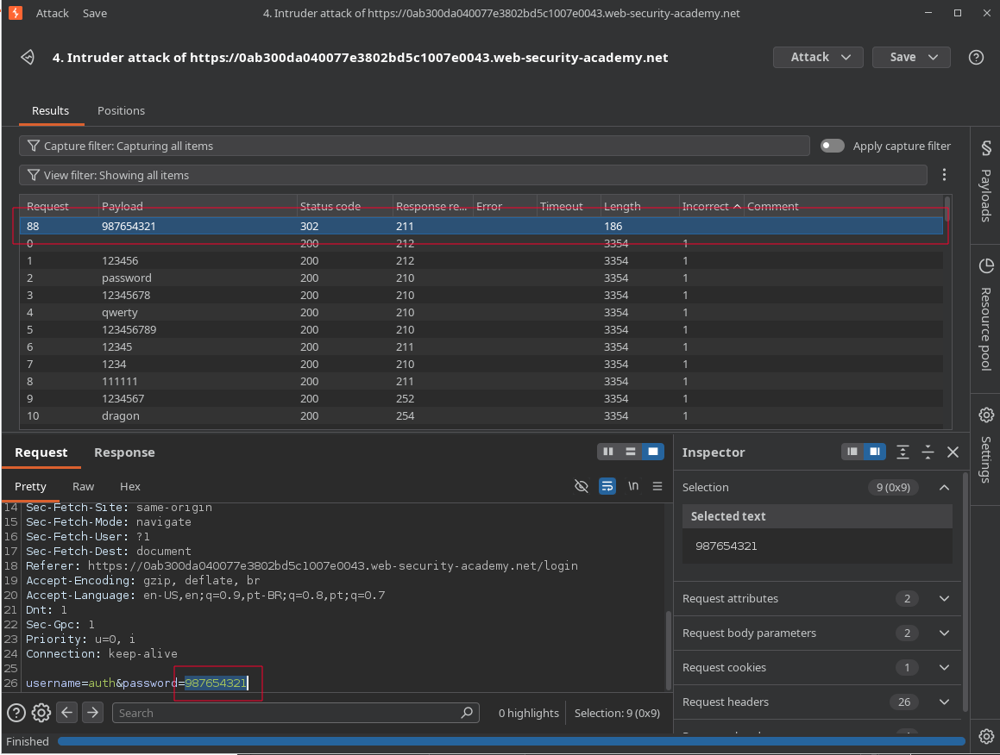

# Lab: Username enumeration via different responses

## Enunciado (traduzido)
Este lab é vulnerável a enumeração de usernames e ataques de força bruta de senha. Ele tem uma conta com username e senha previsíveis, que podem ser encontrados nas seguintes wordlists:

- Candidate usernames
- Candidate passwords

Para resolver o lab, enumere um username válido, faça força bruta na senha desse usuário e acesse sua página de conta.

## O que fiz

Nesse caso o lab disponibiliza duas listas, uma de usernames e outra de senhas candidatas.

Testando o login com qualquer valor, a aplicação retorna `Invalid username`. Isso deixa claro que o username usado realmente não existe, e também que é possível enumerar quais usernames existem apenas observando a resposta.

Peguei pelo Burp a requisição POST de login e mandei para o Intruder.



Com isso dá pra fazer um brute-force: selecionando no corpo da requisição o valor parâmetro `username` e clicando em `Add`, ele vira uma variável de ataque.



Do lado direito, em `Payload configuration`, colei (`Paste`) a lista de usernames.



Para facilitar a análise, em `Grep - Match` que fica em `Settings` bem na sidebar direita, coloquei o termo `Invalid`. Assim, quando uma resposta não contiver esse termo, é sinal de que deu um resultado diferente, talvez indicando um username válido.



Então bastou clicar em `Start attack`.



Olhando pela coluna do termo que configurei, o username `auth` foi o único que não retornou `Invalid`.



Testando o login com esse username, a resposta agora é diferente (indicando senha incorreta, não username inválido).



Repeti o mesmo processo no Intruder, agora com o username fixo em `auth` e variando a senha:



Troquei o Grep-Match de `Invalid` para `Incorrect`, e usei a lista de senhas em `Payload configuration`.

Assim encontrei a combinação:
```
username=auth
password=987654321
```



---
[⬅ Voltar](../../../README.md)