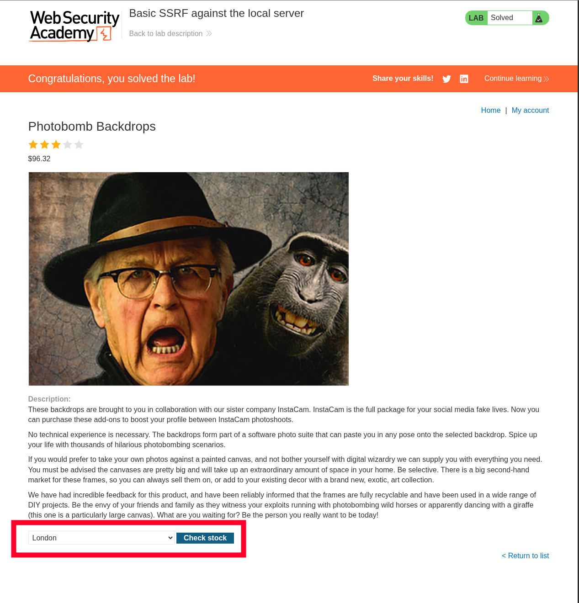
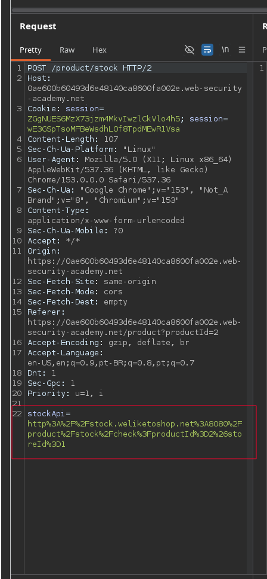
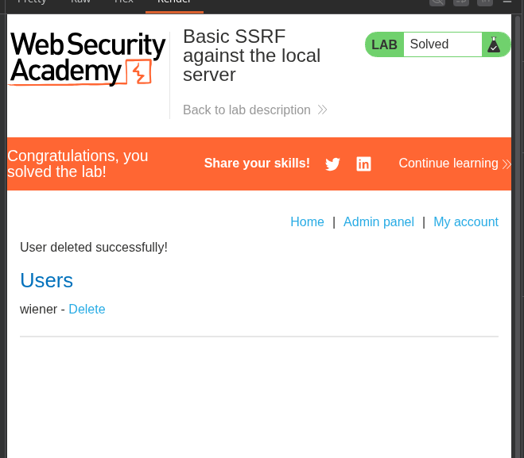
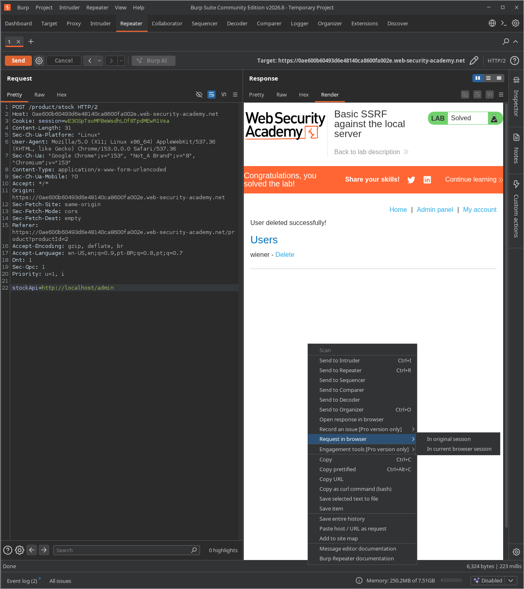
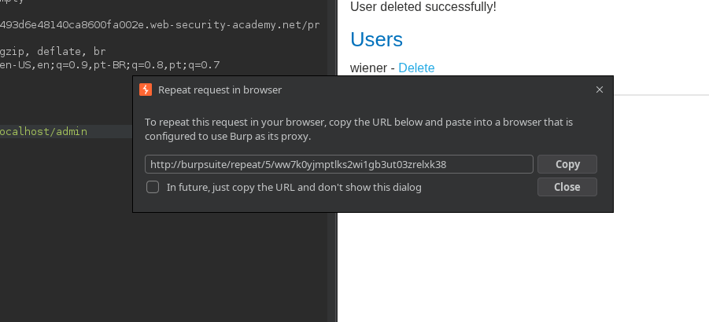
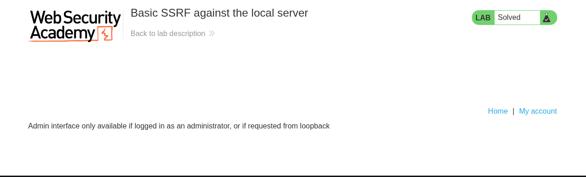
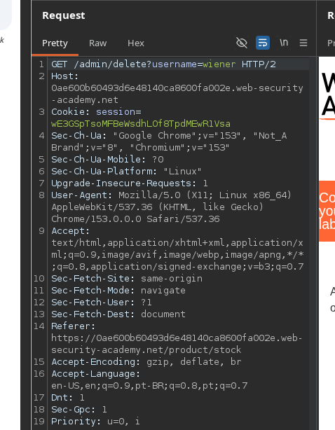

# Lab: Basic SSRF against the local server

## Enunciado (traduzido)

Este lab tem uma funcionalidade de verificação de estoque que busca dados de um sistema interno.

Para resolver o lab, altere a URL de verificação de estoque para acessar a interface de admin em `http://localhost/admin` e delete o usuário `carlos`.

## O que fiz

Primeiro, precisamos encontrar algo que use uma API externa, como a checagem de estoque de um produto.

Verificando o produto e observando a requisição:

Lá está:

Alterando a URL para `http://localhost/admin` no Repeater, conseguimos ver/acessar a funcionalidade de admin:

Copiando o resultado e acessando a página, tentamos deletar o usuário, mas somos impedidos de fazer isso diretamente pela interface:

Porém, pelo Burp conseguimos ver como deletar o usuário.

Então bastou trocar de `http://localhost/admin` para `http://localhost/admin/delete?username=carlos`.

---

[⬅ Voltar](../../../README.md)
