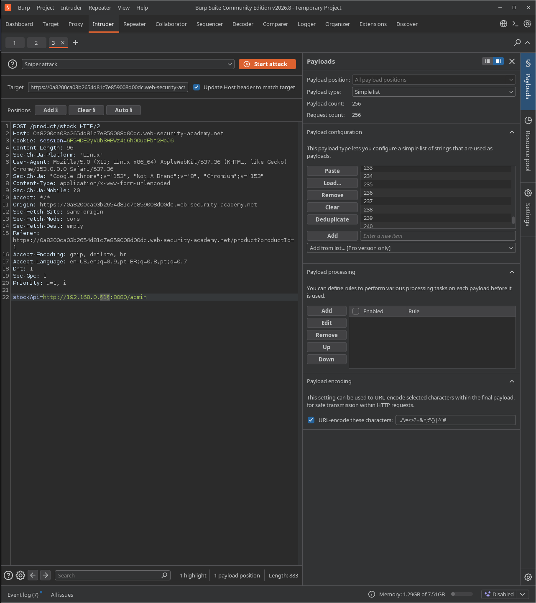
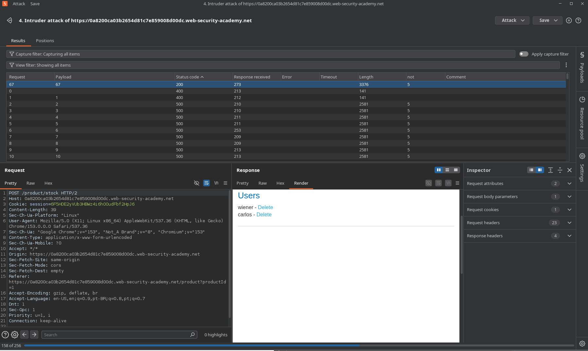

# Lab: Basic SSRF against another back-end system

## Enunciado (traduzido)
Este lab tem uma funcionalidade de verificação de estoque que busca dados de um sistema interno.

Para resolver o lab, use a funcionalidade de verificação de estoque para escanear a faixa interna `192.168.0.X` em busca de uma interface de admin na porta `8080`, depois use-a para deletar o usuário `carlos`.

## O que fiz

Para esse, basicamente seguimos os mesmos passos do [Lab: Basic SSRF against the local server](../01-basic-ssrf-against-localhost/README.md).

Porém, é necessário fazer uma varredura para descobrir o valor correto de `X`.

Fiz isso usando valores de 1 a 254 no Intruder, pois a rede vai de 1 a 255. Sendo o 0 o endereço da própria rede, e 255 o endereço de broadcast.



Ao encontrar o valor `67` olhando o `Status code`, bastou seguir da mesma forma que no lab anterior.



Assim, o resultado final foi:

```
stockApi=http://192.168.0.67:8080/admin/delete?username=carlos
```

---
[⬅ Voltar](../../../README.md)