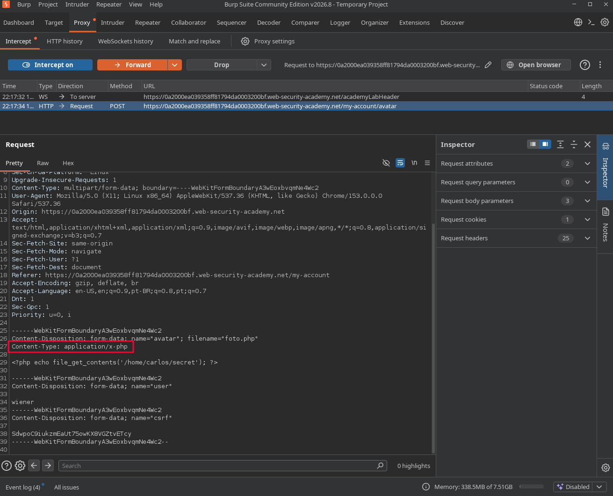
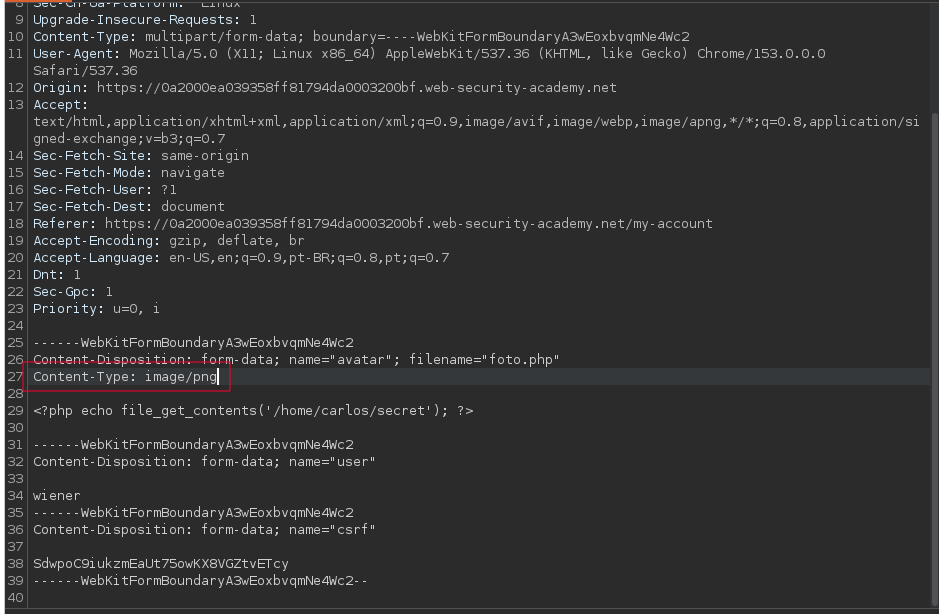

# Lab: Web shell upload via Content-Type restriction bypass

## Enunciado (traduzido)
Este lab contém uma função de upload de imagem vulnerável. Ela tenta impedir que usuários façam upload de tipos de arquivo inesperados, mas se baseia na checagem de um input controlável pelo usuário para fazer essa verificação.

Para resolver o lab, faça upload de uma web shell básica em PHP e use-a para exfiltrar o conteúdo do arquivo `/home/carlos/secret`. Envie esse segredo usando o botão fornecido no banner do lab.

Você pode logar na sua própria conta usando as credenciais: `wiener:peter`

## O que fiz

O processo segue a base do lab anterior, criando um arquivo `.php` para ler o segredo:

```php
<?php echo file_get_contents('/home/carlos/secret'); ?>
```

A diferença é que neste cenário o servidor tenta validar o arquivo checando apenas o cabeçalho `Content-Type` da requisição multipart. Como esse cabeçalho é definido pelo próprio cliente, a validação é ineficaz.

Ao interceptar o upload no Burp, o navegador definiu automaticamente o `Content-Type` como `application/x-php`, o que resultou em erro de tipo de arquivo inválido:



No Repeater, alterei manualmente o cabeçalho para `Content-Type: image/jpeg`, mantendo o nome do arquivo como `exploit.php`:



O servidor aceitou o upload. Acessei o arquivo em `/files/avatars/exploit.php`, o código PHP foi executado pelo backend, revelando o segredo de Carlos que submeti na solução.

---
[⬅ Voltar](../../../README.md)