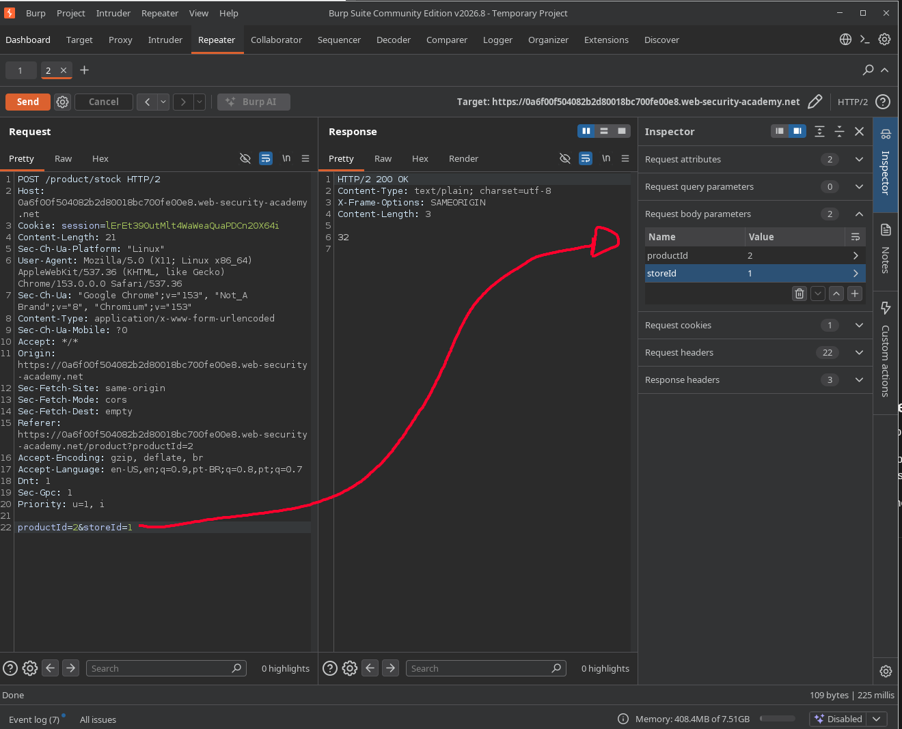
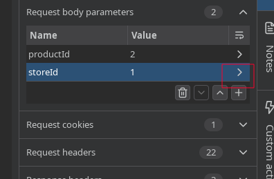
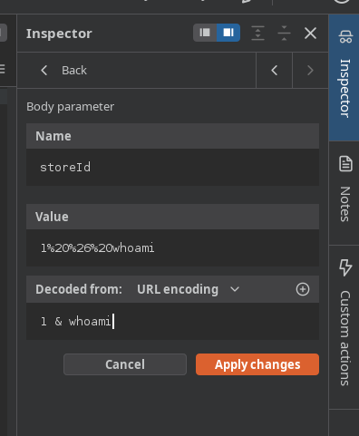

# Lab: OS command injection, simple case

## Enunciado (traduzido)

Este lab contém uma vulnerabilidade de OS command injection no verificador de estoque de produtos.

A aplicação executa um comando shell contendo IDs de produto e loja fornecidos pelo usuário, e retorna a saída bruta do comando na resposta.

Para resolver o lab, execute o comando `whoami` para descobrir o nome do usuário atual.

## O que fiz

Para esse, fizemos uma requisição de "check stock":

Essa requisição GET representa os seguintes parâmetros:

Clicando no último parâmetro (`storeId`), conseguimos editar ou adicionar conteúdo, e o Burp formata automaticamente o texto pra um padrão aceitável (URL encoding):

Então basta inserir o comando `whoami`, aplicar e enviar a requisição, lembrando de usar operadores de controle, como o `&`.

---

[⬅ Voltar](../../README.md)
