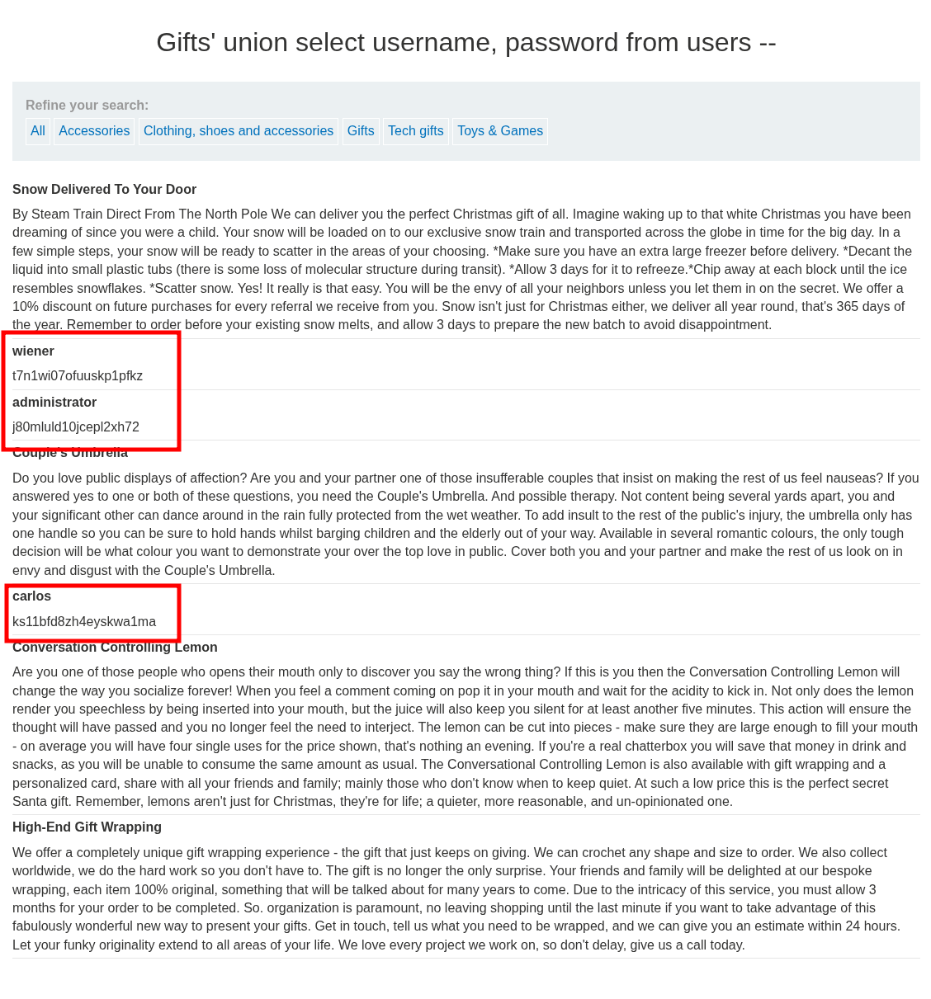

# Lab: SQL injection UNION attack, retrieving data from other tables

## Enunciado (traduzido)

Este lab contém uma vulnerabilidade de SQL injection no filtro de categoria de produtos. Os resultados da consulta são retornados na resposta da aplicação, portanto você pode usar um ataque UNION para recuperar dados de outras tabelas. Para construir esse ataque, você precisará combinar algumas das técnicas aprendidas nos labs anteriores.

O banco de dados contém uma tabela diferente chamada `users`, com colunas chamadas `username` e `password`.

Para resolver o lab, realize um ataque de SQL injection UNION que recupere todos os nomes de usuário e senhas, e use as informações obtidas para fazer login como o usuário `administrator`.

## O que fiz

Neste lab, o objetivo é utilizar o `UNION` para extrair dados sensíveis de uma tabela totalmente diferente da consulta original: a tabela `users`. O fluxo segue a mesma lógica dos labs anteriores.

Primeiro, descobrimos a quantidade de colunas que a query original possui utilizando a cláusula `ORDER BY`:

```sql
.../filter?category=Gifts' ORDER BY 1--
.../filter?category=Gifts' ORDER BY 2--
.../filter?category=Gifts' ORDER BY 3--
```

A requisição funcionou nos índices 1 e 2, mas retornou erro no número 3. Isso confirma que a consulta original retorna **exatamente 2 colunas**.

Em seguida, precisamos verificar se essas 2 colunas aceitam dados do tipo texto (string), já que nomes de usuário e senhas são textos:

```sql
.../filter?category=Gifts' UNION SELECT 'a', NULL--
.../filter?category=Gifts' UNION SELECT NULL, 'a'--
```

Ambos os testes responderam com sucesso e exibiram a letra `'a'` na tela, confirmando que **as duas colunas aceitam texto**.

Com essas duas informações (2 colunas no total e ambas do tipo texto), podemos montar a query final buscando os campos `username` e `password` diretamente da tabela `users`:

```sql
.../filter?category=Gifts' UNION SELECT username, password FROM users--
```



Ao enviar o payload, a aplicação renderiza na página a lista completa de usuários e suas respectivas senhas que estavam guardadas no banco. 

Basta copiar as credenciais do usuário `administrator`, acessar a página de login (`/login`), autenticar-se com essa conta e o lab é concluído.

---

[⬅ Voltar](../../README.md)
