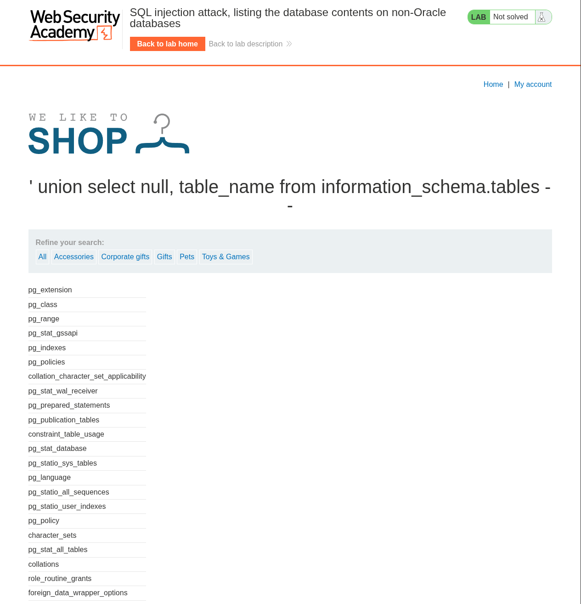
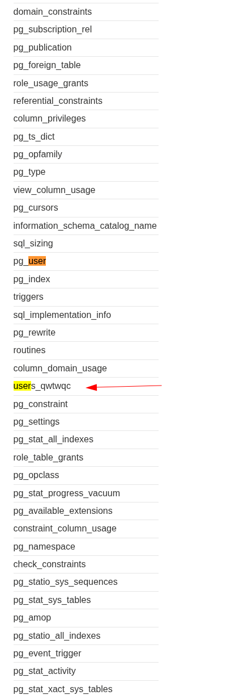
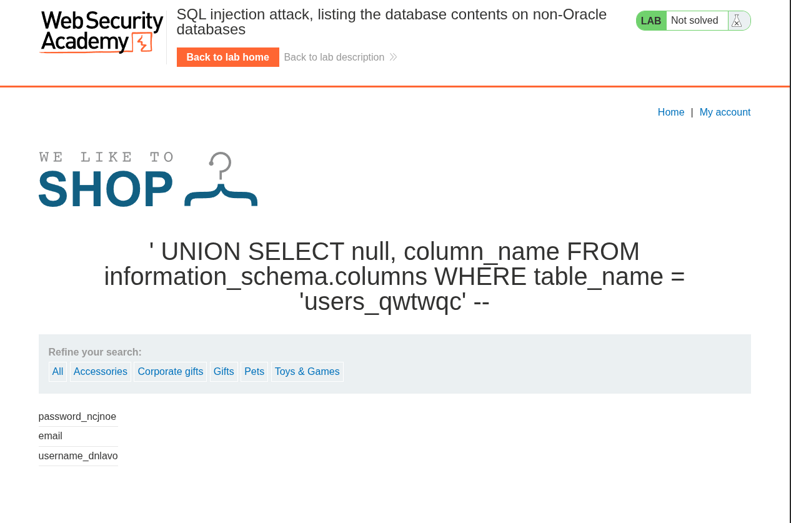
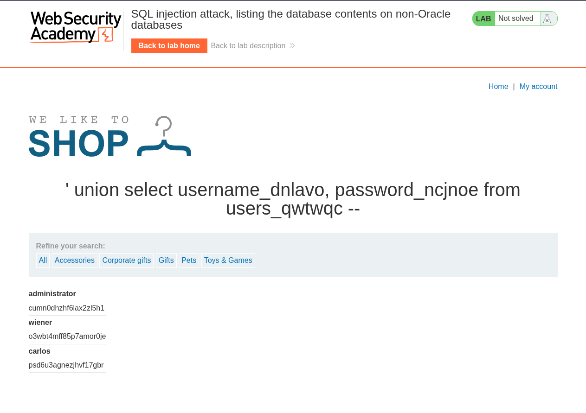

# Lab: SQL injection attack, listing the database contents on non-Oracle databases

## Enunciado (traduzido)

Este lab contém uma vulnerabilidade de SQL injection no filtro de categoria de produtos. Os resultados da consulta são retornados na resposta da aplicação, permitindo que você use um ataque UNION para recuperar dados de outras tabelas.

A aplicação possui uma funcionalidade de login e o banco de dados contém uma tabela que armazena nomes de usuário e senhas. Você precisa determinar o nome dessa tabela e os nomes das colunas que ela contém, para então extrair o conteúdo da tabela e obter o usuário e a senha de todos os usuários.

Para resolver o lab, faça login como o usuário `administrator`.

## O que fiz

O objetivo deste lab é extrair o usuário e a senha do administrador. Porém, diferente dos labs anteriores, nós **não sabemos** qual é o nome da tabela e nem como se chamam as colunas onde essas credenciais estão salvas.

Para resolver isso, precisamos de um processo em etapas: preparar a injeção, mapear o mapa do banco de dados (tabelas e colunas) e, por fim, extrair as credenciais.


### Preparando o canal de injeção (Colunas e Tipos)

Antes de pedir qualquer informação nova ao banco via `UNION`, precisamos atender às duas regras obrigatórias: saber a quantidade exata de colunas e quais delas aceitam texto.

Testamos a quantidade de colunas incrementando a cláusula `ORDER BY`:

```sql
.../filter?category=' ORDER BY 1--
.../filter?category=' ORDER BY 2--
.../filter?category=' ORDER BY 3--
```

* `ORDER BY 1` e `ORDER BY 2` responderam com sucesso.
* `ORDER BY 3` retornou erro interno, pois o banco tentou ordenar por uma coluna que não existe.

Isso confirma que a consulta original trabalha com **exatamente 2 colunas**.

Em seguida, testamos se essas colunas aceitam o tipo de dado texto (strings), substituindo os valores por `'a'`:

```sql
.../filter?category=' UNION SELECT 'a', NULL--
.../filter?category=' UNION SELECT NULL, 'a'--
```

Ambos os testes funcionaram e renderizaram a letra `'a'` na tela, confirmando que **as 2 colunas aceitam texto**. Temos o canal de extração pronto.


### Mapeando as tabelas com o `information_schema`

Agora que temos o canal pronto com 2 colunas, precisamos responder: *onde estão as credenciais?*

Na maioria dos bancos de dados relacionais (como MySQL, PostgreSQL, MSSQL, MariaDB), existe um catálogo interno chamado **`information_schema`**. Ele funciona como um grande mapa de metadados do próprio banco de dados.

O `information_schema` não é uma tabela comum, mas sim um **esquema (schema)** que contém várias **visões (views)**. Para ver as tabelas existentes, consultamos a visão `information_schema.tables`:

```text
[ Schema: information_schema ]
│
├── [ tables ] ───────────────────► Informações sobre as tabelas
│     ├── table_catalog
│     ├── table_schema
│     ├── table_name
│     └── table_type
│
├── [ columns ] ──────────────────► Informações sobre as colunas
│     ├── table_catalog
│     ├── table_schema
│     ├── table_name
│     ├── column_name
│     ├── data_type
│     └── ordinal_position
│
├── [ schemata ] ─────────────────► Informações sobre os schemas
│     ├── catalog_name
│     └── schema_name
│
├── [ views ] ────────────────────► Informações sobre as views
│     ├── table_schema
│     └── table_name
│     └── [ ... ] ──────────────────────► Outras informações de metadadosmetadados
```

### **Tabela cola**
| View                          | Atributo           | O que informa                               |
| ----------------------------- | ------------------ | ------------------------------------------- |
| `information_schema.tables`   | `table_name`       | Nome da tabela                              |
| `information_schema.tables`   | `table_schema`     | Schema ao qual a tabela pertence            |
| `information_schema.tables`   | `table_type`       | Tipo do objeto, como `BASE TABLE` ou `VIEW` |
| `information_schema.columns`  | `column_name`      | Nome da coluna                              |
| `information_schema.columns`  | `table_name`       | Tabela à qual a coluna pertence             |
| `information_schema.columns`  | `data_type`        | Tipo de dado da coluna                      |
| `information_schema.columns`  | `ordinal_position` | Posição da coluna na tabela                 |
| `information_schema.schemata` | `schema_name`      | Nome do schema                              |


### **Por que não podemos usar `SELECT * FROM information_schema.tables`?**  
Porque o `*` tentaria puxar todos os atributos dessa visão (`table_catalog`, `table_schema`, `table_name`, `table_type`, etc.), ultrapassando o nosso limite de 2 colunas e quebrando a injeção via `UNION`.

Portanto, pedimos explicitamente apenas o atributo **`table_name`** e preenchemos a outra coluna com `NULL`:

```sql
.../filter?category=' UNION SELECT NULL, table_name FROM information_schema.tables--
```

> **Nota sobre o Oracle:** O banco de dados Oracle é uma exceção e não utiliza o padrão `information_schema`. Nele, essa mesma consulta de tabelas seria feita através da view nativa `all_tables`.



A aplicação listou todas as tabelas do sistema. Usando o `Ctrl + F` no navegador para buscar por termos relacionados a usuários (`user`), encontramos a tabela alvo gerada dinamicamente: **`users_qwtwqc`**.




### Mapeando as colunas da tabela alvo

Já sabemos o nome da tabela (`users_qwtwqc`), mas ainda não sabemos quais campos (colunas) existem dentro dela para guardar o usuário e a senha.

Para isso, consultamos outra visão do catálogo: a **`information_schema.columns`**, projetando o atributo **`column_name`**.

Aqui, o uso da cláusula condicional `WHERE table_name = 'users_qwtwqc'` é essencial. Se não filtrarmos pelo nome da tabela, o banco despejará os nomes de todas as colunas de todas as tabelas do sistema misturadas:

```sql
.../filter?category=' UNION SELECT NULL, column_name FROM information_schema.columns WHERE table_name = 'users_qwtwqc'--
```



A consulta retornou a estrutura de colunas dessa tabela específica, revelando onde estão os dados para o usuario, email e senha.


### Extraindo as credenciais e concluindo o lab

Com o nome da tabela e os nomes das duas colunas descobertos, montamos a query final para extrair os dados sensíveis preenchendo as duas posições de texto:

```sql
.../filter?category=' UNION SELECT username_dnlavo, password_ncjnoe FROM users_qwtwqc--
```



A tela exibiu a lista completa de usuários e senhas. Copiamos a senha da conta `administrator`, fomos até a página de login (`/login`), autenticamos com sucesso e o lab foi resolvido.


[⬅ Voltar](../../../README.md)